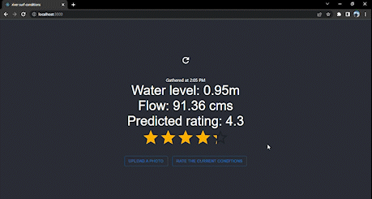

# River Surf Conditions

[River surf conditions](http://rsc.vercel.app/) is a web app created using the MERN stack that provides information about river waves in Calgary.

## Rating the current conditions

From the home page we are able to rate the current conditions. This rating will train the machine learning model with the current flow, water level, and user rating.

## Uploading a photo

It is not visible in the recording, but the datetime picker is auto-filled with the EXIF data from the uploaded image
